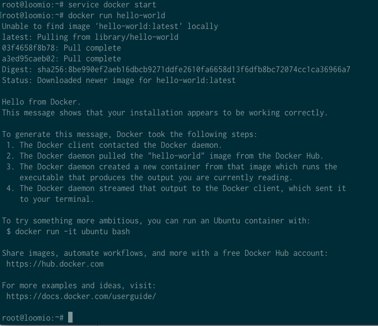
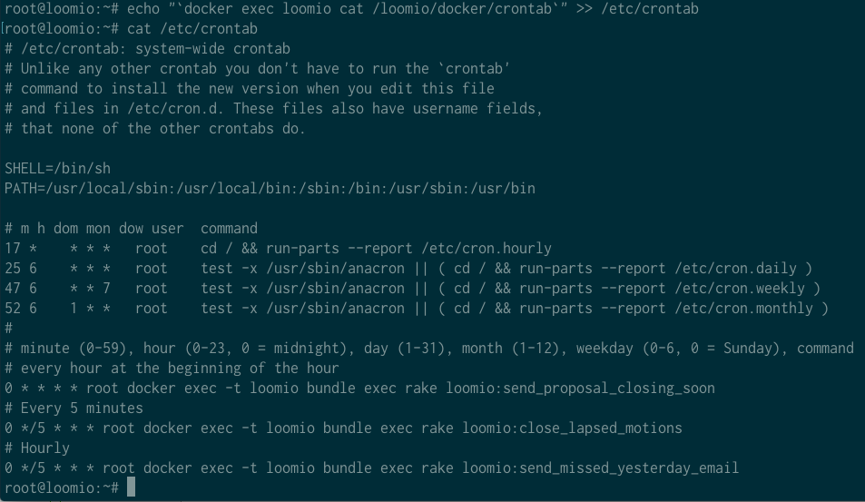

# how to deploy loomio

This guide will show you how to deploy a fully functional Loomio instance
to your own ubuntu linux servers using docker images.

## decide on your hostname
To access your Loomio instance on the web you'll need a domain to host it on. For this guide you'll need access to create records for your domain.

Decide what hostname your Loomio instance will have, shortly you'll need to create a DNS record with your DNS provider.

I'm going to use `loomio.dinotech.co.nz`

## Setup your server

Using your choice of cloud service (or with your own hardware), create a new server running the latest x64 build of Ubuntu Linux.

Be sure to give it the hostname you decided upon.

[This is what creating a VPS looks like](create_vps.png) on DigitalOcean

Now you have your server's IP address, add a DNS record for your server with your DNS provider.

[This is what creating a DNS A record looks like](create_dns_a_record.png) using DigitalOcean's name management service.

### Login as root
To login to the server, open a terminal window and type:

```
$ ssh root@loomio.dinotech.co.nz
```

It'll look like this:


### Create a swapfile

To create a 4GB swapfile just copy and paste the following commands (all at once) into your terminal after you've logged in.

```sh
fallocate -l 4G /swapfile
chmod 600 /swapfile
mkswap /swapfile
swapon /swapfile
echo "/swapfile   none    swap    sw    0   0" >> /etc/fstab
```

Success looks like this:


### Install docker

Now paste the following commands into your terminal to install Docker.

```sh
apt-get update
apt-get install -y apt-transport-https ca-certificates
```

Then copy and paste this
```
apt-key adv --keyserver hkp://p80.pool.sks-keyservers.net:80 --recv-keys 58118E89F3A912897C070ADBF76221572C52609D
echo "deb https://apt.dockerproject.org/repo ubuntu-wily main" > /etc/apt/sources.list.d/docker.list
apt-get update
apt-cache policy docker-engine
apt-get install -y linux-image-extra-$(uname -r) docker-engine
```

and then these two lines, which start the docker service and confirm it's working.

```sh
service docker start
docker run hello-world
```

If all that went correctly, your terminal should look like this:



## Configure Loomio

Create directories on the host to store config and user data.

```sh
mkdir -p /loomio/pgdata
mkdir -p /loomio/uploads
mkdir -p /loomio/config
```

Create a config file:

```sh
echo export DEVISE_SECRET=`openssl rand -base64 48` >> /loomio/config/env
echo export SECRET_COOKIE_TOKEN=`openssl rand -base64 48` >> /loomio/config/env
```

Now edit your `/loomio/config/env` file.

```
nano /loomio/config/env
```

Copy and paste the following text, then modify to suit your setup.

```sh
export DATABASE_URL=postgresql://postgres:password@db/loomio_production
export CANONICAL_HOST=loomio.dinotech.co.nz
export TLD_LENGTH=3
export SMTP_DOMAIN=loomio.dinotech.co.nz
export SMTP_SERVER=smtp.something.com
export SMTP_PORT=465
export SMTP_USERNAME=smtpusername
export SMTP_PASSWORD=smtppassword
export LOOMIO_SSL_KEY=/config/letsencrypt/live/loomio.dinotech.co.nz/privkey.pem
export LOOMIO_SSL_CERT=/config/letsencrypt/live/loomio.dinotech.co.nz/fullchain.pem
```

You can leave the `DATABASE_URL` line unmodified.

`CANONICAL_HOST` is hostname you chose at the beginning of this guide.
`TLD_LENGTH` is equal to the number of dots in your hostname.

`SMTP_DOMAIN` is the domain that emails from loomio have. Use the same value as `CANONICAL_HOST` for now.

Loomio will not work without properly configured SMTP settings.

Setting up a mail server can be a lot of work, here are your options:

- If you already have a mail server, that's great, you know what to do.

- For less than 99 emails a day you can [use your gmail account and smtp.google.com](https://www.digitalocean.com/community/tutorials/how-to-use-google-s-smtp-server) for free.

- There are free service tiers available from [SendGrid](https://sendgrid.com/) (12k emails/month) [SparkPost](https://www.sparkpost.com/) (100k emails/month) [Mailgun](http://www.mailgun.com/) (10k emails/month), [Mailjet](https://www.mailjet.com/pricing) (6k emails/month).

- Very shortly we'll publish a guide to setting up your own secure SMTP server.

### Issue SSL certificate

You can use Let's Encrypt to obtain an SSL certificate.

Running this command will guide you through generating an SSL certificate.

```
docker run -it --rm -p 443:443 -p 80:80 --name letsencrypt \
            -v "/loomio/config/letsencrypt:/etc/letsencrypt" \
            -v "/var/lib/letsencrypt:/var/lib/letsencrypt" \
            quay.io/letsencrypt/letsencrypt:latest auth
```

Your certificate is now the `/loomio/config/letsencrypt/live/` folder.

Todo: explain how to use an existing SSL certificate.

### Start postgresql

Now with one command you can pull down the postgresql docker image and start it:

```sh
docker run --name postgres \
           -v /loomio/pgdata:/pgdata \
           -e POSTGRES_PASSWORD=password \
           -e PGDATA=/pgdata \
           -d postgres
```

and run `docker ps` to confirm that the container is running:


Now we are going to run a command which pulls down the loomio app container then runs a database setup script upon the postgres database.

Note to self: loomio/loomio:docker should  be changed to loomio/loomio:latest

Run this command to setup the Loomio database.

```sh
docker run --link postgres:db \
           loomio/loomio:docker \
           rake db:setup
```

the output should look like this:


## Starting Loomio

note: link the SSL certificate, add an env for ssl

Now start the Loomio app container:

```sh
docker run --name loomio \
           --link postgres:db \
           -v /loomio/uploads:/uploads/ \
           -v /loomio/config:/config/ \
           -p 80:3000 \
           -d \
           loomio/loomio:docker
```

Now you should be able visit https://yourhostname.com/ and see a login screen.

If you run into trouble try the `docker logs` command. This returns the output of a daemonized docker container.

```sh
docker logs loomio
```

### Setup recurring jobs

You need to install this crontab file so that Loomio will perform routine work such as emailing people when proposals are going to close.

```sh
echo "`docker exec loomio cat /loomio/docker/crontab`" >> /etc/crontab
cat /etc/crontab
```

Looks like this:


## Setup inbound email

One cool feature of Loomio is that people can reply to discussions from their email client.

To do this, you need to create an MX DNS record to tell the internet what server is handling mail for your host.

It's an MX record with priority 0 with the same hostname.


The `loomio/mailin-docker` image runs [mailin](http://mailin.io) which is an SMTP server that converts emails to into web requests.

```sh
docker run --name mailin \
           --link loomio:loomio \
           -e WEBHOOK_URL=http://loomio:3000/email_processor/ \
           -d loomio/mailin-docker
```

Note to self: link to a docker cheat sheet or write my own.

## Setup live update


```
git clone https://github.com/letsencrypt/letsencrypt
cd letsencrypt
./letsencrypt-auto --help
letsencrypt certonly --webroot -w /var/www/example -d example.com -d www.example.com -w /var/www/thing -d thing.is -d m.thing.is
```

Todo: How to setup an automatic build of your own Loomio fork to run your own set of plugins
